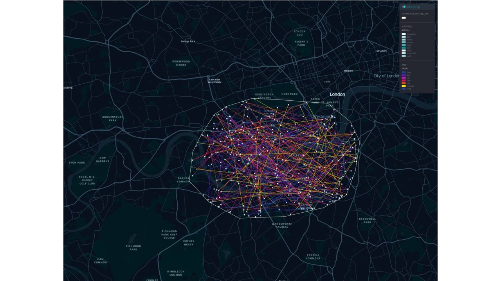

# Londinium - An example city of a transport ABM.

The Londinium is  a bigger, more realistic datasetthan Test Town that we can use it for testing our tools.

The Londinium dataset is comprised of:

- an OSM data file covering a region in west London
- a GTFS public transit schedule for the same geographical area
- a synthetic MATSim population of 100 agents with travel plans inside this region

## OSM Data
We chose the location so as to have a selection of different public transit modes, allowing us to see agents
interchange modes. We also wanted to have a mixture of major and minor roads, which this particular section of west
London gives us.

### Geographical Bounds
<kbd></kbd>
<kbd></kbd>
<kbd></kbd>

## Population Data
The Londinium synthetic population includes various activities, personal attributes and modes. The agents created
were classified into different subpopulations by gender and income. Activities are Home-to-Home round trips, all
within 24 hours. Daily activity plans for each agent were created using random choice. Agents choose different travel
modes such as bus, walk, car randomly for each trip.

**The generation of londinium population are from a [notebook](https://github.com/arup-group/pam/blob/main/examples/04_Example-Create-Population-Londinium.ipynb) using a open source tool called [pam](https://github.com/arup-group/pam)**

For example, we used the above notebook to generate a population including 100 agents. Each agent will have activity plan within 24 hours and random choose a mode between activities.  

### Population Files
| File                                       | Size   |
| -------------------------------------------|:-------|
| `data/population/population.xml`           | 126k   |

### Population Details
|                      |         |
| -------------------- |:--------|
| No. Agents           | 100     |
| No. Households       | 100     |
| No. Subpopulations   | 3       |
| Subpopulation split  | <ul><li>`low income`: 28% <li>`medium income`: 35% <li>`high income`: 37%</ul> |
| Gender split         | <ul><li>Female: 51% <li>Male: 49%</ul> |
| Household LAD split  | <ul><li>`Wandsworth`: 25% <li>`Kensington and Chelsea`: 22% <li>`Hammersmith and Fulham`: 19% <li>`Lambeth`: 18% <li>`Westminster`: 14% <li>`Richmond upon Thames`: 2% </ul>
| No trip legs         | 352     |
| Leg mode counts      | <ul><li>48 mode="walk" <li>42 mode="bike" <li>54 mode="car" <li>49 mode="subway" <li>47 mode="rail" <li>50 mode="ferry" <li>62 mode="bus"</ul>
| No. Activities       | 452     |
| Activity type counts | <li>200: type="home" <li>40: type="shop" <li>41: type="medical" <li>46: type="gym" <li>22: type="park" <li>17: type="leisure" <li>44: type="pub" <li>25: type="education" <li>27: type="work" |
  
An example of activity plan from generated population
<kbd></kbd>
