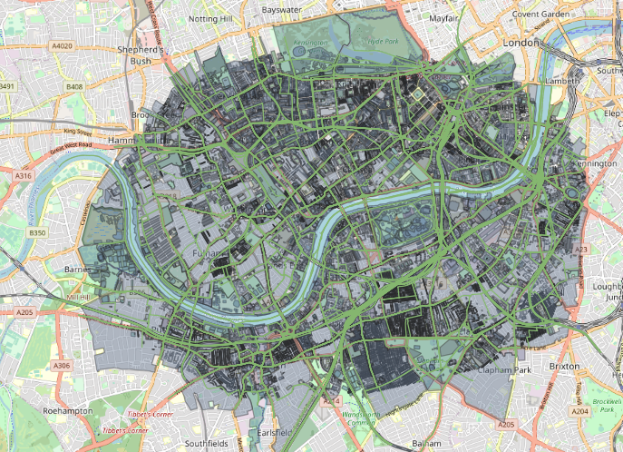

# Londinium - An example MATSim dataset

Londinium is a semi-synthetic dataset for use with [MATSim agent based models](https://www.matsim.org/). The intention
is to provide a dataset small enough to use when running MATSim on a typical developer laptop, but big enough
to give MATSim a useful workout. Londinium uses real OSM and GTFS data, combined with a synthetic population of agents.

The Londinium dataset is comprised of:

- "pre-baked", ready-made MATSim input files:
  - [network](data/network/network.xml)
  - [vehicles](data/network/vehicles.xml)
  - [schedule](data/network/schedule.xml)
  - [population](data/population/population.xml)
- [LSOA data](data/lsoas) - used to generate the agent activity plans
- an [OSM data file](data/network/osm) covering a region in west London - used to generate
[the MATSim network](data/network/network.xml)
- a [GTFS public transit schedule](data/network/gtfs/Londinium_arup_gb_rail_and_tnds_2020-03-12) for the
geographical area covered by the OSM file - used to generate [the MATSim network](data/network/network.xml),
[schedule](data/network/schedule.xml) and [vehicles](data/network/vehicles.xml) files used as input to MATSim
- a [synthetic MATSim population](data/population/population.xml) of 100 agents with travel plans inside this region

## OSM Data
We chose the location so as to have a selection of different public transit modes, allowing us to see agents
interchange modes. We also wanted to have a mixture of major and minor roads, which this particular section of west
London gives us.

### Geographical Bounds
<kbd></kbd>
<kbd></kbd>

## Population Data
The Londinium synthetic population includes various activities, personal attributes and modes. The agents created
were classified into different subpopulations by gender and income. Activities are Home-to-Home round trips, all
within 24 hours. Daily activity plans for each agent were created using random choice. Agents choose different travel
modes such as bus, walk, car randomly for each trip.

**The generation of the Londinium population used a
[notebook](https://github.com/arup-group/pam/blob/main/examples/04_Example-Create-Population-Londinium.ipynb) from
[PAM](https://github.com/arup-group/pam), our open source population activity modeller**

We used the above notebook to generate a population including 100 agents. Each agent will have activity plan within 24 hours and random choose a mode between activities.  

### Population Files
| File                                       | Size   |
| -------------------------------------------|:-------|
| `data/population/population.xml`           | 123k   |

### Population Details
|                      |         |
| -------------------- |:--------|
| No. Agents           | 100     |
| No. Households       | 100     |
| No. Subpopulations   | 3       |
| Subpopulation split  | <ul><li>`low income`: 30% <li>`medium income`: 40% <li>`high income`: 30%</ul> |
| Gender split         | <ul><li>Female: 50% <li>Male: 50%</ul> |
| Household LAD split  | <ul><li>`Wandsworth`: 26% <li>`Kensington and Chelsea`: 21% <li>`Hammersmith and Fulham`: 20% <li>`Lambeth`: 18% <li>`Westminster`: 13% <li>`Richmond upon Thames`: 2% </ul> |
| No trip legs         | 352     |
| Leg mode counts      | <ul><li>  62 mode="bus" <li>  54 mode="car" <li>  50 mode="ferry" <li>  49 mode="subway" <li>  48 mode="walk" <li>  47 mode="rail" <li>  42 mode="bike" </ul> |
| No. Activities       | 452     |
| Activity type counts |  <ul>  <li>200 "home"  <li>44 "pub"  <li>41 "medical"  <li>40 "shop"  <li>36 "gym"  <li>27 "work"  <li>25 "education"  <li>22 "park"  <li>17 "leisure" </ul> |
  
An example of activity plan and trips from generated population:
<kbd></kbd>
<kbd></kbd>

### Population Trips Map
<kbd></kbd>

